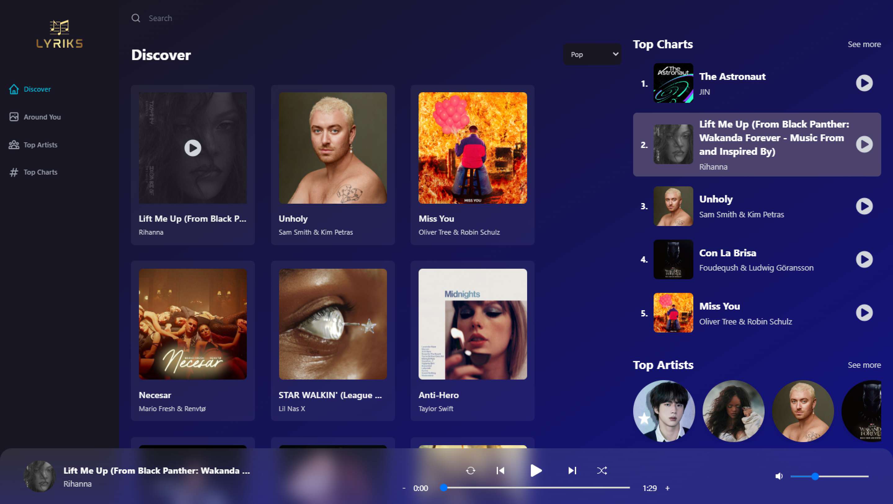

<h1 align="center">
  LYRIKS
</h1>
 

 

  Modern and improved cloned version of Spotify. With a modern homepage, fully-fledged music player, search, lyrics, song exploration features, search, popular music around you, worldwide top charts.

 
<h1 align="center">
  Tech stack
</h1>
 

  Inside the Lyriks app, I worked with the most modern, and in-demand technologies in the JavaScript ecosystem, such as React.js, Tailwind CSS, Redux, Shazam API, CSS, and more!
   

  
  
 A JavaScript library for building   user interfaces 

 
  
  
 A Predictable State Container   for JS Apps 

  
   
  
 A utility-first CSS framework packed with classes   that can be composed to build any design, directly in your markup.. 

    

